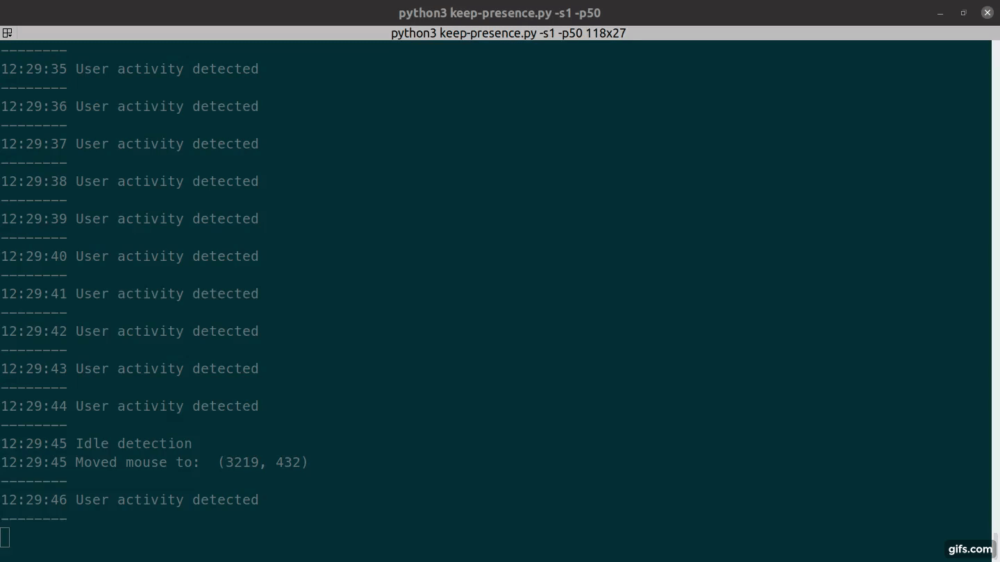

# Keep Presence

This program moves the mouse or press a key when it detects that you are away.  
It won't do anything if you are using your computer.  
Useful to trick your machine to think you are still working with it.
It can be used to avoid going idle on messaging apps like Slack, Microsoft Teams, etc.

## Demo

[](https://github.com/pushpender-singh-ap/keep)

## Installation

```
git clone git@github.com:pushpender-singh-ap/keep.git
```
```
cd keep
```
```
pip3 install pynput
```
```
python3 keep.py
```

### Python Environment Setup (Recommended)

1. **Create a virtual environment:**

```sh
python3 -m venv .venv
```

2. **Activate the virtual environment:**

```sh
source .venv/bin/activate
```

3. **Install dependencies:**

```sh
pip install -r requirements.txt
```

4. **Run the program:**

```sh
python keep.py
```

5. **Start the program with default settings:**

```sh
source .venv/bin/activate && python keep.py
```

---

## About this repository

This repository is the primary copy of the project with some custom changes and improvements. It is originally a fork of the project at <https://github.com/carrot69/keep-presence> — please refer to that original repository for upstream history and the original implementation. Use this repository (`pushpender-singh-ap/keep`) as the primary source for the current custom version.

## Optional arguments

```
-h, --help                        show this help message and exit
            
-s SECONDS, --seconds SECONDS     Define in seconds how long to wait after a user is
                                  considered idle. Default 300.

-p PIXELS, --pixels PIXELS        Set how many pixels the mouse should move. Default 1.

-c, --circular                    Move mouse in a circle. Default move diagonally.

-m MODE, --mode MODE              Available options: keyboard, mouse, both; default is mouse. 
                                  This is the action that will be executed when the user is idle. 
                                  If keyboard is selected, the program will press the shift key. 
                                  If mouse is selected, the program will move the mouse. 
                                  If both is selected, the program will do both actions.

-r RANDOM RANDOM, --random RANDOM RANDOM
                                  Usage: two numbers (ex. -r 3 10). Execute actions based on a 
                                  random interval between start and stop seconds. 
                                  Note: Overwrites the seconds argument.
